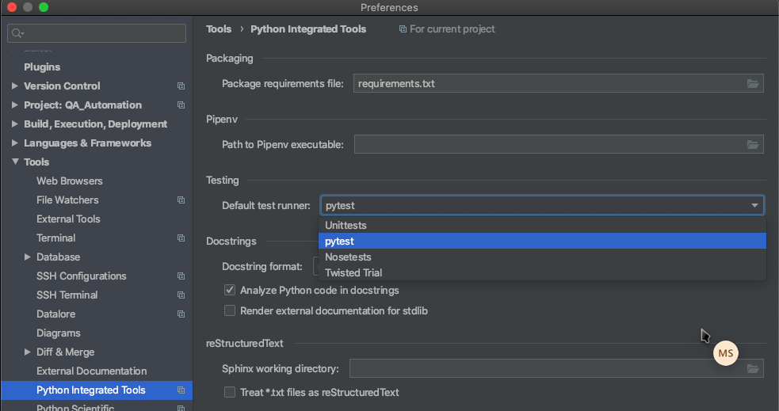

# QA Automaton
This repository contains API automation and web automation 

# Setup
- Download [PyCharm Community Edition - an IDE for Python](https://www.jetbrains.com/pycharm/download/#section=mac)
- Install python3 on your machine:
`brew install python@3.8`
  - NOTE: python 3.9 is not compatible with this project
- `git clone https://github.com/CrowdFlower/QA_Automation.git`
- Open PyCharm > Open the QA_Automation project folder
- Go to PyCharm > Preferences > Project: QA_Automation > Project Interpreter
- Click the gear to add a new interpreter
- Select Virtualenv Environment > new environment and set the base interpreter to python 3. The Location should be auto populated
- Go to Tools > Python Integrated Tools and set the Default test runner to pytest
- Click on the requirements.txt file
- Click install requirements at the top right corner. This is the same as running the command in terminal
`pip install -r requirements.txt`




# Running a test
When you open a test in the directory tests/job, you should see a green arrow indicating that a test can be run. By clicking the arrow you run a module within the test file.
 
# Resources
- PyTest - https://docs.pytest.org/en/latest/reference.html
- Allure Reports Framework - http://allure.qatools.ru/

# Devspace

Prerequisites:
**in f8-development-env-tools**
- A TLS enabled Devspace - this is required since the tests expect a domain suffix of cf3.us
  - infrastructure deployed and healthy
    ```
    $ cd ./devspace && ./check-infrastructure-health.sh
    If no other messages have printed, all known infrastructure pods are Running
    If kafka-connect and kafka-connect-create-topics-job are Initializing, you need to deploy the jobs folder before that can complete.
    ```
  - jobs/devspace.yaml deployed and healthy
    ```
    $ cd ../jobs && ./check-jobs-health.sh
    If no other messages have printed, all known pods for the jobs group are Running
    ```

## Deploy + Sync Local Repo to Remote Test Execution Environment in your Devspace

### Dev Mode (recommended)
 
Run `devspace dev` in its own terminal window to deploy the QA Automation system to your devspace. It will automatically sync changes you make locally to your devspace.

### Full Build + Deploy (only recommended if dev mode is glitching)

You may also `devspace deploy` but this will build a whole new docker image and deploy it to your devspace which takes a long time. Use only if needed.

## Running the tests

You can use the `integration-test` command to run the tests against your devspace
```
devspace run integration-test --test-set=adap_api_smoke
```

 ### Terminal examples
   #### To list the help message use `-h` or `--help`

  ```
   $ devspace run integration-test -h
     Possible args:
      -s,  --space=your-devspace (required, name of devspace under test)
      -ts, --test-set=mark       (required, specific pytest mark)
      -f,  --file='./adap/subdir'    (filter tests by file or directory)
      -m,  --marker-expr='m1 not m2' (filter tests by expression)
      -w,  --workers=N               (default=4, 0=show debug logs)
           --flaky     (present == true)
           --all-tests (present == true)
      -h,  --help      (print this message)
  ```

   #### To run non-flaky `adap_api_smoke` tests against your space

   ```
   $ devspace run integration-test --test-set=adap_api_smoke
   ```

   #### To add tests that are ususally skipped for being "flaky", include `--flaky`

   ```
   $ devspace run integration-test \
     --test-set=adap_api_smoke \
     --flaky 
   ```

   #### To filter the tests by pytest marks, include `--marker-expr='MARKEREXPR'`
   
   For more on pytest filtering see [MARKEREXPR](https://docs.pytest.org/en/6.2.x/example/markers.html) docs

   ```
   $ devspace run integration-test \
     --test-set=adap_api_smoke \
     --marker-expr='adap_api_smoke not jobs'
     ## i.e. run 'adap_api_smoke' tests unless also tagged with 'jobs'
   ```

   #### To filter the tests by directory or file, include `--file='./path/to/dir_or_file'`

   ```
   $ devspace run integration-test \
     --test-set=adap_api_smoke \
     --file='./adap/api_automation/tests/job/'
     ## i.e. run 'adap_api_smoke' tests in the job folder
   ```

## Check the results

There are two options to check the results of the tests

### Allure

Forward the results server to your machine
```
devspace run allure
```

Then navigate to: [localhost:5252](http://localhost:5252) and click on the menu bar in the left to select `default`

### Python server

Use `devspace open` and select `qa-automation:8000`
    
## Running the tests locally (non devspace deploy)

If you need to run the tests in your local machine you can do so by manually setting the dependencies:

### Akon:
1. Check to ensure users all seeded 
   ```
    ➜ kubectl exec deploy/akon-web-services -c web -- ./script/entrypoint_devspace.sh rails r 'pp User.order(:name).pluck(:id,:name)'
   ```
   Should show:
   ```
    [["00000000-0000-0000-0000-000000000035", "active-learning user"],
     ["00000000-0000-0000-0000-000000000013", "advanced_settings_requester user"],
     ["00000000-0000-0000-0000-000000000036", "akon user"],
     ["00000000-0000-0000-0000-000000000049", "api-proxy user"],
     ["00000000-0000-0000-0000-000000000051", "appen_connect user"],
     ["00000000-0000-0000-0000-000000000050", "audit-service user"],
     ["00000000-0000-0000-0000-000000000000", "basic_requester user"],
     ["00000000-0000-0000-0000-000000000039", "builder user"],
     ["00000000-0000-0000-0000-000000000025", "cf_internal_role_2 user"],
     ["00000000-0000-0000-0000-000000000024", "cf_internal_role user"],
     ["00000000-0000-0000-0000-000000000018", "cf_internal user"],
     ["00000000-0000-0000-0000-000000000045", "client-api-proxy user"],
     ["00000000-0000-0000-0000-000000000017", "contributor_support_provider user"],
     ["00000000-0000-0000-0000-000000000034", "contributor-support-proxy user"],
     ["00000000-0000-0000-0000-000000000014", "contributor_support user"],
     ["00000000-0000-0000-0000-000000000009", "education_requester user"],
     ["00000000-0000-0000-0000-000000000005", "enterprise_requester user"],
     ["00000000-0000-0000-0000-000000000042", "gardener user"],
     ["00000000-0000-0000-0000-000000000038", "gold user"],
     ["00000000-0000-0000-0000-000000000046", "jobs_api user"],
     ["00000000-0000-0000-0000-000000000040", "make user"],
     ["00000000-0000-0000-0000-000000000001", "managed_basic_requester user"],
     ["00000000-0000-0000-0000-000000000003", "managed_pro_requester user"],
     ["00000000-0000-0000-0000-000000000008", "managed_requester user"],
     ["00000000-0000-0000-0000-000000000028", "multi_team_user_2 user"],
     ["00000000-0000-0000-0000-000000000029", "multi_team_user_3 user"],
     ["00000000-0000-0000-0000-000000000027", "multi_team_user user"],
     ["00000000-0000-0000-0000-000000000010", "nonprofit_requester user"],
     ["00000000-0000-0000-0000-000000000043", "notifications user"],
     ["00000000-0000-0000-0000-000000000031", "org_admin user"],
     ["00000000-0000-0000-0000-000000000015", "organization_admin user"],
     ["00000000-0000-0000-0000-000000000019", "organization_manager user"],
     ["00000000-0000-0000-0000-000000000012", "pay_as_you_go_requester user"],
     ["00000000-0000-0000-0000-000000000004", "project_based_pricing user"],
     ["00000000-0000-0000-0000-000000000002", "pro_requester user"],
     ["00000000-0000-0000-0000-000000000044", "raas user"],
     ["00000000-0000-0000-0000-000000000007", "starter_requester user"],
     ["00000000-0000-0000-0000-000000000011", "startup_requester user"],
     ["00000000-0000-0000-0000-000000000020", "super_admin user"],
     ["00000000-0000-0000-0000-000000000037", "tasks user"],
     ["00000000-0000-0000-0000-000000000041", "taxonomyzer user"],
     ["00000000-0000-0000-0000-000000000016", "team_admin user"],
     ["00000000-0000-0000-0000-000000000023", "test_account user"],
     ["00000000-0000-0000-0000-000000000026", "test_contributor_task user"],
     ["00000000-0000-0000-0000-000000000030", "test_predefined_jobs user"],
     ["00000000-0000-0000-0000-000000000047", "test-question-generator user"],
     ["00000000-0000-0000-0000-000000000032", "test_ui_account user"],
     ["00000000-0000-0000-0000-000000000048", "text-annotation user"],
     ["00000000-0000-0000-0000-000000000022", "tq_generator_admin_requester user"],
     ["00000000-0000-0000-0000-000000000021", "tq_generator_requester user"],
     ["00000000-0000-0000-0000-000000000006", "trial_requester user"],
     ["00000000-0000-0000-0000-000000000033", "workflows-service user"]]
   
   ```
2. if missing users, manually re-run the seeding process
   ```
   ➜ kubectl exec -it deploy/akon-web-services -c web -- /app/script/entrypoint_devspace.sh rake db:seed
   ```

### Make:
1. Check seeding completed fully
   ```
   ➜ kubectl exec -it deploy/make-services -c web -- /app/script/entrypoint_devspace.sh rails r 'pp Builder::User.order(:email).pluck(:akon_id, :email)'
   ```
   Should show:
   ```  
   WARNING: Could not load omniauth. SSO functionality will not work in this application.
   Passing 'to_str' command to redis as is; blind passthrough has been deprecated and will be removed in redis-namespace 2.0 (at /usr/local/lib/ruby/2.5.0/uri/rfc3986_parser.rb:16:in `split')
   WARNING: Could not load omniauth. SSO functionality will not work in this application.
   /app/config/initializers/constants.rb:67: warning: already initialized constant WORKER_UI_EXTERNAL_URL
   /app/config/initializers/constants.rb:37: warning: previous definition of WORKER_UI_EXTERNAL_URL was here
   W, [2022-05-21T01:25:32.721418 #366]  WARN -- : Akon config does not exist; not autoloading
   D, [2022-05-21T01:25:32.931189 #366] DEBUG -- : using default configuration
   D, [2022-05-21T01:25:34.051242 #366] DEBUG -- :   [master/1] (1.6ms)  SELECT "users"."akon_id", "users"."email" FROM "users"  ORDER BY "users"."email" ASC
   [["00000000-0000-0000-0000-000000000035", "active-learning@figure-eight.com"],
    ["00000000-0000-0000-0000-000000000036", "akon@figure-eight.com"],
    ["00000000-0000-0000-0000-000000000050", "audit-service@figure-eight.com"],
    ["00000000-0000-0000-0000-000000000000", "basic_requester@figure-eight.com"],
    ["00000000-0000-0000-0000-000000000039", "builder@figure-eight.com"],
    ["00000000-0000-0000-0000-000000000018", "cf_internal@figure-eight.com"],
    ["00000000-0000-0000-0000-000000000025", "cf_internal_role_2@figure-eight.com"],
    ["00000000-0000-0000-0000-000000000024", "cf_internal_role@figure-eight.com"],
    ["00000000-0000-0000-0000-000000000009", "education_requester@figure-eight.com"],
    ["00000000-0000-0000-0000-000000000005", "enterprise_requester@figure-eight.com"],
    ["00000000-0000-0000-0000-000000000038", "gold@figure-eight.com"],
    ["00000000-0000-0000-0000-000000000046", "jobs_api@figure-eight.com"],
    ["00000000-0000-0000-0000-000000000040", "make@figure-eight.com"],
    ["00000000-0000-0000-0000-000000000001", "managed_basic_requester@figure-eight.com"],
    ["00000000-0000-0000-0000-000000000003", "managed_pro_requester@figure-eight.com"],
    ["00000000-0000-0000-0000-000000000008", "managed_requester@figure-eight.com"],
    ["00000000-0000-0000-0000-000000000028", "multi_team_user_2@figure-eight.com"],
    ["00000000-0000-0000-0000-000000000029", "multi_team_user_3@figure-eight.com"],
    ["00000000-0000-0000-0000-000000000027", "multi_team_user@figure-eight.com"],
    ["00000000-0000-0000-0000-000000000010", "nonprofit_requester@figure-eight.com"],
    ["00000000-0000-0000-0000-000000000031", "org_admin@figure-eight.com"],
    ["00000000-0000-0000-0000-000000000012", "pay_as_you_go_requester@figure-eight.com"],
    ["00000000-0000-0000-0000-000000000002", "pro_requester@figure-eight.com"],
    ["00000000-0000-0000-0000-000000000007", "starter_requester@figure-eight.com"],
    ["00000000-0000-0000-0000-000000000011", "startup_requester@figure-eight.com"],
    ["00000000-0000-0000-0000-000000000037", "tasks@figure-eight.com"],
    ["00000000-0000-0000-0000-000000000041", "taxonomyzer@figure-eight.com"],
    ["00000000-0000-0000-0000-000000000023", "test_account@figure-eight.com"],
    ["00000000-0000-0000-0000-000000000026", "test_contributor_task@figure-eight.com"],
    ["00000000-0000-0000-0000-000000000030", "test_predefined_jobs@figure-eight.com"],
    ["00000000-0000-0000-0000-000000000032", "test_ui_account@figure-eight.com"],
    ["00000000-0000-0000-0000-000000000048", "text-annotation@figure-eight.com"],
    ["00000000-0000-0000-0000-000000000022", "tq_generator_admin_requester@figure-eight.com"],
    ["00000000-0000-0000-0000-000000000021", "tq_generator_requester@figure-eight.com"],
    ["00000000-0000-0000-0000-000000000006", "trial_requester@figure-eight.com"],
    ["00000000-0000-0000-0000-000000000033", "workflows-service@figure-eight.com"]]
   ```
2. if missing users, manually re-run the seeding process
   ```
   ➜ kubectl exec -it deploy/make-services -c web -- /app/script/entrypoint_devspace.sh rake db:seed
   ```
3. TODO: other make seeds to check for? or is item 2 good enough

### QA Automation
1. Checkout master branch, ensure working directory is the root of the repository
2. Run configuration file generation script: `./adap/generate_devspace_required_files.sh`
3. Run script to copy configuration files to the QA repo: `./adap/copy_devspace_required_files.sh`
4. Build the container and run tests

### Running the tests

```
$ docker run --rm -it --volume=$PWD:/srv qa-automation -- /srv/jenkins_support/run_devspace.sh \
  --space=adap-001 \
  --test-set=adap_api_smoke
```  

   ### Vscode

   Documentation update TBD

   1. Open the project in Vscode. The container will automatically be built and synced with your file system
   2. There are a couple of ways to run the tests
      1. From the top menu bar choose 'Terminal / Run Task...'
      2. select 'Run devspace tests' and follow the prompts to configure a test run
      2. Within the Vscode terminal window (a terminal on the container) it will run something like:
         ```
         $ ./jenkins_support/run_devspace.sh --space=adap-001 --test-set=adap_api_smoke
         ```
